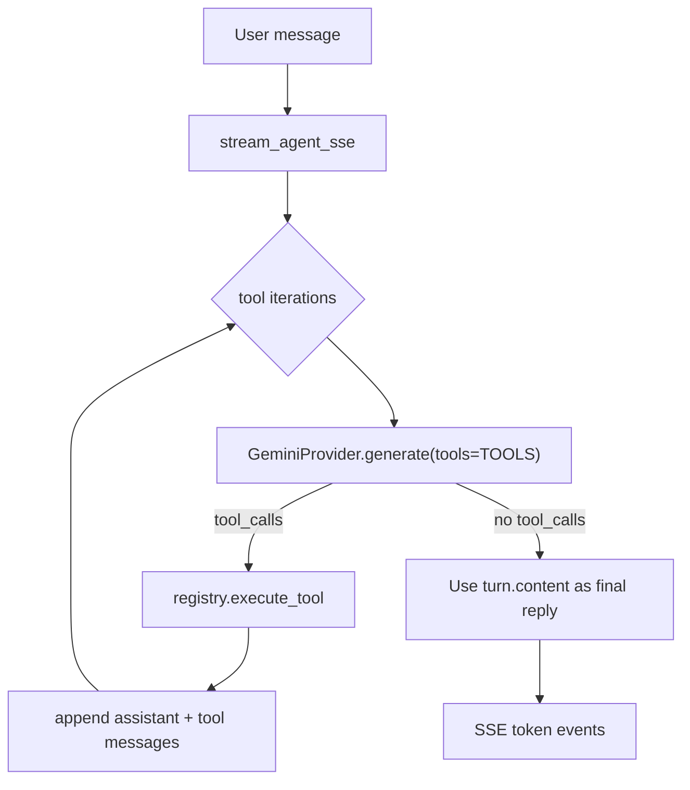

# Simplify for interview

## Goal

Interviewers should grasp the agent in **~5 minutes**: read [`prompts.py`](backend/app/agent/prompts.py) → [`runner.py`](backend/app/agent/runner.py) tool loop → [`registry.py`](backend/app/tools/registry.py) + [`actions.py`](backend/app/tools/actions.py) / [`read.py`](backend/app/tools/read.py) → mock data [`scenario1.json`](backend/app/data/scenario1.json). Everything else is supporting noise today.

**Assumption:** One LLM backend (**Gemini only**, per your choice) is enough; multi-provider abstraction and OpenAI-compat paths are out of scope for this assignment.

**Out of scope for this plan:** Any `EVALUATION.md`, rubric, or expanded agent-behavior test suite—you will do evaluation yourself.

---

## What to remove or collapse

| Area | Why it confuses | Action |
|------|-----------------|--------|
| [`openai_client.py`](backend/app/agent/llm/openai_client.py), OpenAI env vars, [`factory.py`](backend/app/agent/llm/factory.py) | Second provider + indirection | Delete OpenAI client; runner constructs `GeminiProvider` directly |
| `LLMProvider.stream` + runner’s **two** output paths ([`runner.py`](backend/app/agent/runner.py) L40–46: char-replay vs `stream` fallback) | Hard to explain; stream omits tools by design | Drop `stream` from ABC and Gemini; after tool loop, yield final assistant text from the last `generate` turn (single SSE path) |
| [`test_llm_factory.py`](backend/tests/test_llm_factory.py), [`test_gemini_thought_signature.py`](backend/tests/test_gemini_thought_signature.py) | Test plumbing / private Gemini API | Remove; replace with nothing or one smoke import test if needed |
| `ToolCall.thought_signature_b64` + encoding in [`gemini_client.py`](backend/app/agent/llm/gemini_client.py) | Interviewers don’t need Gemini 2.5 thinking round-trip | Remove field and related mapping unless you hit a runtime error on your chosen model (`gemini-2.0-flash`); keep `ToolCall` as `id`, `name`, `arguments_json` only |
| Stale plan [`.cursor/plans/unified_llmprovider_refactor_cc3ca72c.plan.md`](.cursor/plans/unified_llmprovider_refactor_cc3ca72c.plan.md) | Looks like unfinished homework | Delete or archive so it doesn’t contradict the repo |
| [`config.py`](backend/app/config.py) `llm_provider` / OpenAI settings | Unused after Gemini-only | Keep `gemini_*`, `max_tool_iterations`; drop OpenAI literals |
| [`conftest.py`](backend/tests/conftest.py) `OPENAI_API_KEY` default | Noise | Gemini key only |

**Keep (core story):** FastAPI + SSE ([`chat.py`](backend/app/api/chat.py), [`sse.py`](backend/app/sse.py)), thin frontend, mock session + scenario data, validation tool, existing tests ([`test_scenario1_agent.py`](backend/tests/test_scenario1_agent.py), [`test_chat_api.py`](backend/tests/test_chat_api.py), health)—no new eval-focused tests unless you add them later.

**Keep lightly (your rules):** [`api-collection/`](backend/api-collection/) + [`openapi.yaml`](backend/openapi.yaml)—trim OpenAI mentions in README only; no need to delete Bruno unless you want fewer files.

---

## Target agent flow (single path)

**Recommended runner simplification (easiest to explain):**

1. Loop: `turn = await llm.generate(LLMRequest(messages, tools=registry.TOOLS))`.
2. If `turn.tool_calls`: append turns, execute tools, continue (unchanged logic using [`base.py`](backend/app/agent/llm/base.py) helpers).
3. If not: set `final_text = turn.content`, **break** (no second API call).
4. Yield `final_text` to SSE (single yield or small chunks—avoid per-character replay unless you want “typing” UX).

If `max_tool_iterations` is exhausted while the model still returns tool calls, return a clear error string in SSE instead of the current silent `stream()` fallback.

---

## LLM layer after simplification

**Files:** [`base.py`](backend/app/agent/llm/base.py) (types + append helpers), [`gemini_client.py`](backend/app/agent/llm/gemini_client.py) (single class with `generate` only).

Optional rename for clarity in README (not required): `gemini_client.py` → `gemini.py`—only if you want one obvious file name.

[`base.py`](backend/app/agent/llm/base.py) can stay as dataclasses; avoid adding new abstractions. `ChatTurn = LLMResponse` alias is fine to delete if it duplicates.

---

## README trim

Update [`backend/README.md`](backend/README.md):

- One diagram: Chat → Runner → Gemini + Tools → Validate.
- Setup: Gemini env only.
- **“What to read first”** ordered list (prompt → runner → registry).
- Tests: `pytest` covers tools + API wiring (existing files only).

Frontend README: one line “optional demo UI.”

---

## Out of scope (avoid scope creep)

- No `EVALUATION.md` or agent-scenario documentation in-repo (your work).
- No new production patterns (observability, retries, rate limits).
- No re-expanding OpenAI or `LLMProvider` hierarchy beyond one Gemini class.
- No large frontend refactors (markdown chat UI is fine).

---

## Implementation order

1. Simplify runner (single output path; handle max iterations explicitly).
2. Remove OpenAI + `stream`; shrink `GeminiProvider` and `config`.
3. Delete obsolete tests; fix imports (`get_llm` → direct provider).
4. Trim README; update openapi/env examples if OpenAI removed.
5. Quick pass: `pytest`, optional manual chat smoke test.
