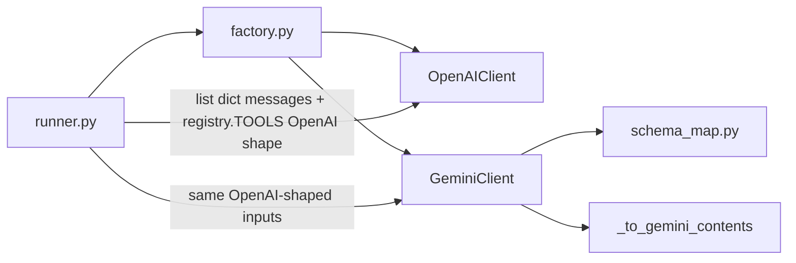
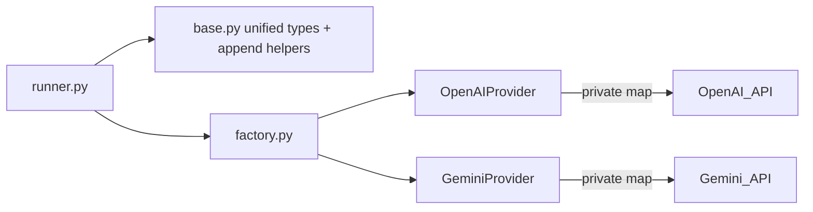

# Unified LLMProvider refactor

## Current state



Both providers expose the same duck-typed API (`chat_with_tools`, `stream_chat`, `append_*`), but Gemini alone converts OpenAI-style messages/tools via [`_to_gemini_contents`](backend/app/agent/llm/gemini_client.py) and [`openai_tools_to_gemini_declarations`](backend/app/agent/llm/schema_map.py). Append helpers are duplicated (Gemini only adds `thought_signature_b64` on assistant tool_calls).

## Target architecture



**Assumption:** The canonical contract is provider-neutral dataclasses in [`base.py`](backend/app/agent/llm/base.py). Each subclass owns all SDK-specific mapping as private methods (no shared “OpenAI as lingua franca” at the runner boundary).

## 1. Unified domain model — [`backend/app/agent/llm/base.py`](backend/app/agent/llm/base.py)

Extend/replace existing types (keep `ToolCall`; `ChatTurn` can alias or fold into response):

| Type | Purpose |
|------|---------|
| `Message` | `role`, optional `content`, optional `tool_calls`, optional `tool_call_id` / `name` for tool results |
| `ToolDefinition` | `name`, `description`, `parameters` (JSON Schema dict) |
| `LLMRequest` | `messages: list[Message]`, `tools: list[ToolDefinition]` |
| `LLMResponse` | `content: str \| None`, `tool_calls: list[ToolCall]` (same fields as today’s `ChatTurn`) |

**Provider-agnostic conversation helpers** (pure functions or `Message` list mutators):

- `append_assistant_tool_turn(messages, turn: LLMResponse) -> None` — include `thought_signature_b64` on embedded `ToolCall` when present (single implementation replaces both clients).
- `append_tool_result(messages, tool_call_id, name, result: str) -> None`

Optional: `messages_from_runner_history(...)` helper if it keeps [`runner.py`](backend/app/agent/runner.py) thin (today `_build_llm_messages` builds dicts).

## 2. Abstract provider — same file or `provider.py`

```python
class LLMProvider(ABC):
    @abstractmethod
    async def generate(self, request: LLMRequest) -> LLMResponse: ...

    @abstractmethod
    async def stream(self, request: LLMRequest) -> AsyncIterator[str]: ...
```

- Factory return type: `LLMProvider`.
- Rename implementations for clarity: `OpenAIClient` → `OpenAIProvider`, `GeminiClient` → `GeminiProvider` (update [`factory.py`](backend/app/agent/llm/factory.py) and tests).

## 3. OpenAI implementation — [`openai_client.py`](backend/app/agent/llm/openai_client.py) (rename optional: `openai_provider.py`)

- Inherit `LLMProvider`.
- `generate`: map `list[Message]` → OpenAI `messages` dicts; map `list[ToolDefinition]` → OpenAI `tools` list (`type: function` wrapper); call existing `chat.completions.create`; map response → `LLMResponse`.
- `stream`: map messages only; yield text deltas (same behavior as today).
- Remove public `append_*` / `chat_with_tools` / `stream_chat`.
- Private helpers: `_to_openai_messages`, `_to_openai_tools` (small, colocated).

## 4. Gemini implementation — [`gemini_client.py`](backend/app/agent/llm/gemini_client.py)

- Inherit `LLMProvider`.
- Move logic from `_to_gemini_contents` → private `_to_gemini_contents(messages: list[Message])`.
- Move [`schema_map.py`](backend/app/agent/llm/schema_map.py) into private `_to_gemini_declarations(tools: list[ToolDefinition])` (then **delete** `schema_map.py` as legacy).
- `generate` / `stream`: same threading/`asyncio.to_thread` pattern as today.
- Preserve Gemini-specific behavior: synthetic system turn, `thought_signature` on function call parts, synthetic tool call ids `call_{name}_{n}`.

## 5. Tool registry — [`backend/app/tools/registry.py`](backend/app/tools/registry.py)

- Replace `TOOLS: list[dict]` (OpenAI envelope) with `TOOLS: list[ToolDefinition]` or a single builder that returns unified definitions.
- Export a small constant list used by the runner when building `LLMRequest(tools=registry.TOOLS, ...)`.
- OpenAI mapping happens only inside `OpenAIProvider`; no OpenAI-shaped tools at the agent layer.

## 6. Runner — [`backend/app/agent/runner.py`](backend/app/agent/runner.py)

- Build `list[Message]` (system + history + user) instead of `list[dict]`.
- Tool loop:

```python
request = LLMRequest(messages=messages, tools=registry.TOOLS)
turn = await llm.generate(request)
# append_assistant_tool_turn / append_tool_result from base
```

- Final streaming: `async for piece in llm.stream(LLMRequest(messages=messages, tools=[]))` (empty tools if SDK allows; otherwise same tools — match current “no tools on stream” behavior: today stream omits tools, so pass `tools=[]`).

## 7. Tests

| File | Change |
|------|--------|
| [`test_llm_factory.py`](backend/tests/test_llm_factory.py) | Assert `OpenAIProvider` / `GeminiProvider` (or `isinstance(..., LLMProvider)`). |
| [`test_gemini_thought_signature.py`](backend/tests/test_gemini_thought_signature.py) | Stop calling private `_to_gemini_contents` on dict messages: build `list[Message]` via `append_assistant_tool_turn`, then test via **private** `_to_gemini_contents` on provider **or** extract a focused unit test on the mapping function if you prefer not to test privates (recommended: test `GeminiProvider._to_gemini_contents` with unified messages — behavior unchanged). |

No new integration tests unless you want them; existing tests should cover factory + thought signature round-trip.

## 8. Files touched (summary)

- **Modify:** `base.py`, `openai_client.py`, `gemini_client.py`, `factory.py`, `runner.py`, `registry.py`, 2 test files
- **Delete:** `schema_map.py` (logic inlined in Gemini provider)

## Design notes

- **Why unified `Message`/`ToolDefinition`:** Runner and tools stop depending on OpenAI JSON shapes; Gemini’s adapter becomes an implementation detail.
- **Why append stays in `base.py`:** Identical across providers today; avoids fat ABC and keeps providers as thin SDK adapters.
- **Why keep `generate` + `stream`:** Matches your async choice and preserves the two-phase agent flow (tool loop then character streaming).
