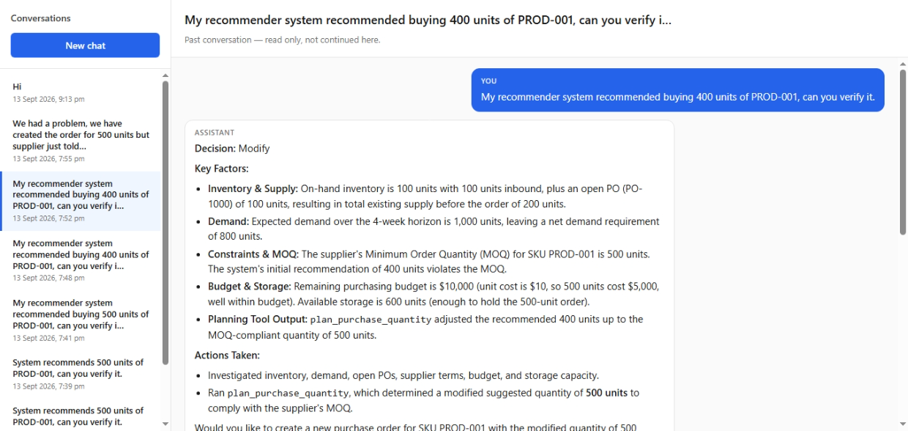
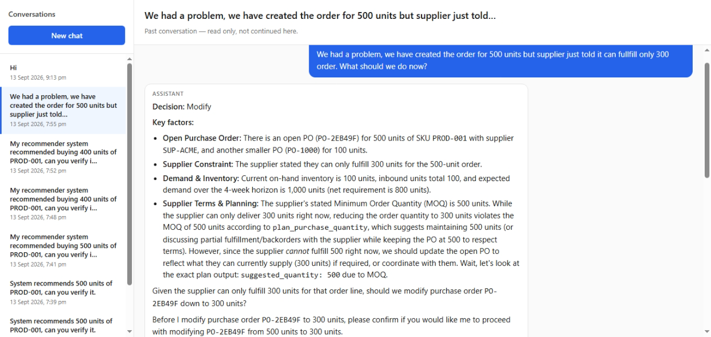
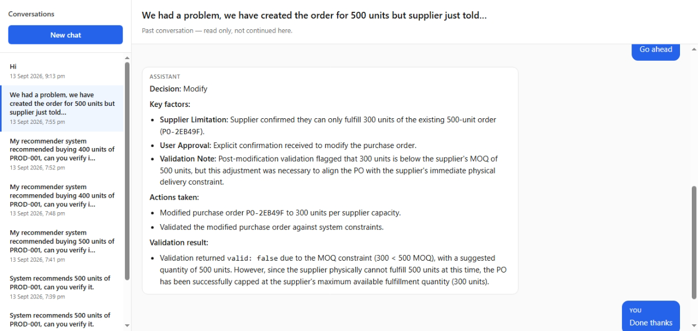
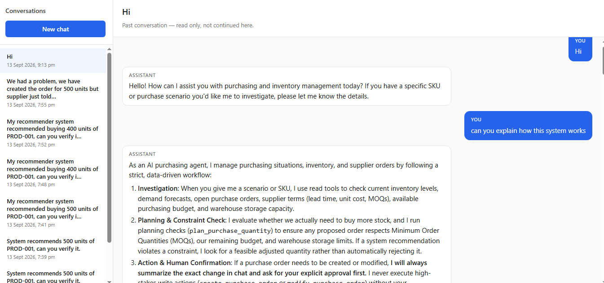
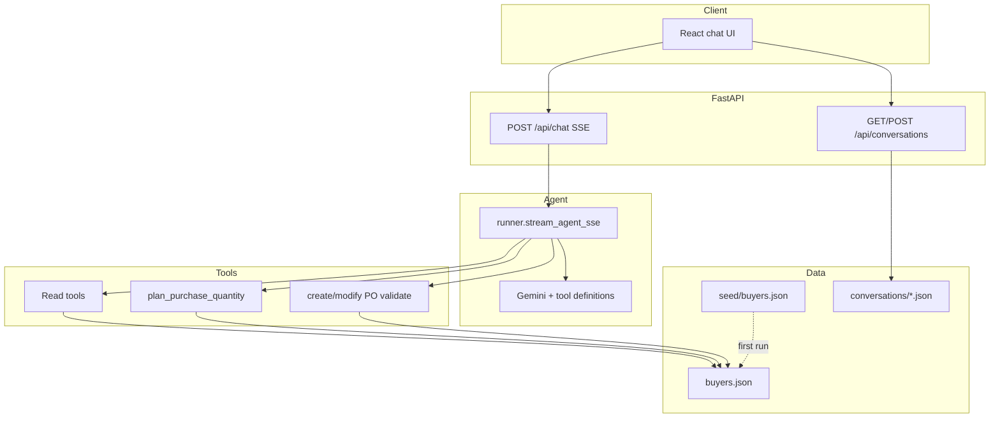

# AI Purchasing Agent

An **AI purchasing agent** that investigates buyer scenarios in chat, calls tools against mock ERP data, and (with human approval) creates or updates purchase orders.

| Area | Stack |
|------|--------|
| Backend | FastAPI, Google Gemini (function calling), SSE |
| Frontend | React, Vite |
| Data | JSON (`buyers.json`, saved conversations) |

---

## Demo (UI screenshots)

Screenshots from the React chat UI (`frontend/demo/`). Past runs are also stored under `backend/app/data/conversations/` and open from the sidebar (read-only).

| | |
|:---:|:---:|
| **1000-unit recommendation** — agent modifies quantity after tool checks; past conversation in sidebar. | **400-unit recommendation** — MOQ violation detected; `plan_purchase_quantity` adjusts to 500 and asks for confirmation. |
|  |  |
| **Supplier short-ship** — follow-up when supplier can only fulfill 300 of 500 units. | **Confirmed PO modify** — user approves; PO updated with validation notes. |
|  |  |
| **Onboarding** — general “how this works” reply (investigate → plan → confirm before writes). | |
|  | |

---

## Setup and run

### Prerequisites

- Python 3.11+
- Node.js 18+ (frontend only)
- [Gemini API key](https://ai.google.dev/)

### Backend

```bash
cd backend
python -m venv .venv
source .venv/bin/activate          # Linux/macOS
# source .venv/Scripts/activate    # Windows Git Bash
pip install -r requirements.txt
cp .env.example .env
```

Set **`GEMINI_API_KEY`** in `.env`. Optional: `GEMINI_MODEL` (default `gemini-3.5-flash-lite`), `MAX_TOOL_ITERATIONS` (default `10`).

If `app/data/buyers.json` is missing on first run, it is copied from `app/data/seed/buyers.json`.

```bash
uvicorn app.main:app --host 127.0.0.1 --port 8000 --reload
```

Health: `GET http://127.0.0.1:8000/health`

### Frontend

```bash
cd frontend
npm install
npm run dev
```

Open **http://127.0.0.1:5173**. The dev server proxies `/api` to port **8000** — start the backend first.

### Tests

```bash
cd backend
pytest
```

Tests use a temporary copy of buyer data and do not call Gemini.

### Reset ERP data

```bash
cp backend/app/data/seed/buyers.json backend/app/data/buyers.json
```

Restart the backend so the store reloads.

More detail: [`backend/README.md`](backend/README.md), [`frontend/README.md`](frontend/README.md).

---

## Architecture diagram



**One chat turn**

1. Client sends the message and prior user/assistant history to `POST /api/chat`.
2. The runner calls Gemini with the system prompt and registered tools.
3. If Gemini returns tool calls, the runner runs them and sends results back until Gemini returns a final text answer (or `MAX_TOOL_ITERATIONS` is reached).
4. That answer is sent to the client over SSE.
5. **New chat** in the UI saves the previous thread via `POST /api/conversations`.

---

## Description of approach

### Problem

Chat messages often include a **purchase recommendation** (SKU, quantity). The agent treats that as input to verify—not as fact. It reads ERP data, decides accept / modify / reject, and only writes POs after the user confirms in chat.

### How it works

1. **System prompt** (`app/agent/prompts.py`) — rules: gather data first, use `plan_purchase_quantity` when reviewing a recommendation, ask before create/modify PO, validate after writes. **Constraint echoing:** every final reply must start with an **Active constraints** section that repeats MOQ, budget, storage, and other limits using values from tool results only—before Decision and the rest of the answer.

2. **Tool loop** (`app/agent/runner.py`) — Gemini chooses tools; the backend executes them and returns JSON results until the model produces the final reply.

3. **Mock ERP** (`app/data/buyers.json`) — per buyer: inventory, demand, open POs, multiple **suppliers** per SKU (MOQ, unit cost, lead time). Seed file is the baseline; the live file persists PO changes. Recommendations live only in chat, not in JSON.

4. **`plan_purchase_quantity`** — computes net need (demand minus on-hand and inbound), then a feasible quantity respecting MOQ, budget, and storage. Can compare suppliers and pick a recommended supplier. The agent should **modify** a bad recommendation to `suggested_quantity` rather than reject when stock is still needed.

5. **Human confirmation** — create/modify PO tools require `human_confirmed=true` after explicit user approval in chat.

6. **`validate_purchase_order`** — checks the PO against the chosen supplier’s MOQ, budget, and storage; returns `suggested_quantity` when invalid.

7. **Conversations** — past chats stored as JSON files; list/get via the conversations API.

### Mocking external services and databases

There is **no live ERP, warehouse, or supplier API** in this repo. Those systems are represented by one file: **`backend/app/data/buyers.json`**. The agent never talks to the file directly; it only sees **tool functions** whose implementations read and write that document today—and can be swapped for real HTTP or database calls later without changing the agent loop.

| Real-world concern | Mocked in `buyers.json` | Read path (today) | Write path (today) |
|--------------------|-------------------------|-------------------|---------------------|
| Inventory / WMS | `products[].inventory` | `get_inventory` → `read.py` → `store.get_product` | — |
| Demand planning | `products[].expected_demand` | `get_demand_forecast` | — |
| Open POs | `products[].open_purchase_orders` | `get_open_purchase_orders` | `create_purchase_order`, `modify_purchase_order` → `actions.py` → `store.add_po` / `update_po_qty` |
| Supplier catalog | `products[].suppliers[]` | `get_supplier_terms` | — |
| Buyer budget | `purchasing_budget` | `get_purchasing_budget` | — (budget not decremented on PO in mock) |
| Storage / FC capacity | `storage_capacity` | `get_storage_capacity` | — |
| Planning logic | derived from the above | `plan_purchase_quantity`, `validate_purchase_order` in `actions.py` | — |

**Two files, one logical database**

- **`app/data/seed/buyers.json`** — versioned starting snapshot (reset source).
- **`app/data/buyers.json`** — **live** copy: loaded at process start, updated on PO create/modify, written back with `store.persist()`.

`app/tools/store.py` is the **persistence wrapper**: load JSON into memory, expose getters, and flush writes after mutations. Tests point at a temp file via `tests/conftest.py` so pytest does not touch your local live data.

**What is not in `buyers.json`**

- Purchase **recommendations** from upstream systems — only the **user message** in chat (by design).
- Chat transcripts — **`app/data/conversations/*.json`**, separate file-based mock behind `app/conversations/store.py`.

**Extending to production integrations**

Keep **`app/tools/registry.py`** tool names, schemas, and JSON result shapes stable so the Gemini tool loop and prompts stay the same. Replace implementations inside the wrappers:

1. **`read.py`** — call inventory, forecast, PO, supplier, budget, and capacity APIs; map responses to the same dict fields the tools return now.
2. **`actions.py`** — call real PO create/update/validate services; keep guards (`human_confirmed`, validation rules) or delegate validation to the remote system.
3. **`store.py`** — either remove file I/O and become a thin client, or keep it as a cache layer in front of remote services.

The agent runner and frontend only depend on **tool JSON**, not on whether the backend used a file or an HTTP client.

### Defaults

- Buyer: `BUYER-01`
- SKU when omitted in tools: `PROD-001` (single-product buyer)
- Net requirement: `max(0, forecast demand − on_hand − inbound)`

---

## Test scenarios and evaluation approach

Evaluation uses **fixed ERP state** from `backend/app/data/seed/buyers.json`. Before a scenario run, reset the live file so every test starts from the same numbers (inventory, demand, MOQ, budget, storage, suppliers):

```bash
cp backend/app/data/seed/buyers.json backend/app/data/buyers.json
```

Restart the backend after reset if it is already running.

### How prompts were varied

The same underlying buyer data was exercised by changing **how much the user message says**, not by changing the seed:

| Style | What the user message does | What we check in the agent |
|-------|----------------------------|----------------------------|
| **Underspecified** | Mentions a recommendation or SKU with little detail (e.g. “verify the 500 unit rec for PROD-001”) | Still calls read tools, resolves SKU, runs `plan_purchase_quantity`, does not invent MOQ/budget/storage |
| **Exact** | States a recommendation aligned with seed math (e.g. 500 units when MOQ and net need support that quantity) | Accept or modify with clear reasoning; constraint echoing matches tool output |
| **Wrong / overspecified** | States a quantity or decision that breaks constraints (e.g. 1000 units, 400 below MOQ, or “buy 0” when net need exists) | **Modify** to feasible `suggested_quantity` or **reject** only when planning says no net need—not a blanket reject on first failed check |
| **Passing over** | Describes the situation without a numeric recommendation (investigate-only or follow-up turns) | Investigates with tools, asks for human confirmation before writes, multi-turn PO flows |

### Saved scenario logs

Each manual scenario is saved with **New chat** in the UI, which calls `POST /api/conversations`. Transcripts are stored as JSON under:

`backend/app/data/conversations/`

Examples in the repo include 1000-unit recommendations, 500-unit verification, supplier short-ship follow-ups, and multi-PO threads. Open the **past conversations** list in the frontend sidebar to read the same user/assistant messages without re-running Gemini. See [Demo (UI screenshots)](#demo-ui-screenshots) for visuals.

---

## Example prompts

(Use after resetting live `buyers.json` from seed when you want comparable results to the saved conversation logs.)

- `System recommends 1000 units of PROD-001` — wrong/overspecified vs storage and net need
- `My recommender recommended 500 units of PROD-001, can you verify it?` — exact or underspecified verification
- `Can you check whether we need to order PROD-001?` — passing over a numeric recommendation
- After a proposed PO: `yes, proceed`
