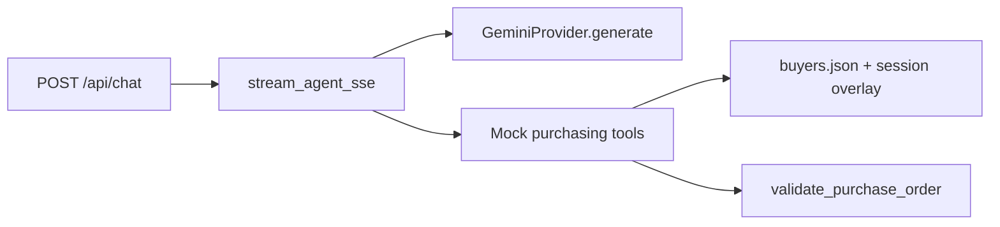

# AI Purchasing Agent — Backend

FastAPI buyer agent with a chat interface. Streams over SSE to the optional Vite frontend.

## Setup

```bash
cd backend
python -m venv .venv
source .venv/Scripts/activate   # Windows Git Bash
pip install -r requirements.txt
cp .env.example .env
# Set GEMINI_API_KEY in .env
```

## Run

```bash
uvicorn app.main:app --host 127.0.0.1 --port 8000 --reload
```

Frontend (optional demo UI): `cd frontend && npm run dev` — proxies `/api` to `:8000`.

## What to read first

1. [`app/agent/prompts.py`](app/agent/prompts.py) — agent rules (scenario text comes from chat, not the prompt)  
2. [`app/agent/runner.py`](app/agent/runner.py) — tool loop, then one final reply over SSE  
3. [`app/tools/registry.py`](app/tools/registry.py) — tool definitions and dispatch  
4. [`app/tools/store.py`](app/tools/store.py) + [`app/data/buyers.json`](app/data/buyers.json) — buyer/product seed data and session PO overlay  
5. [`app/tools/read.py`](app/tools/read.py) / [`app/tools/actions.py`](app/tools/actions.py) — read tools and PO actions  

LLM calls go through [`app/agent/llm/gemini_client.py`](app/agent/llm/gemini_client.py) (`generate` only).

## Data model

- **`buyers.json`**: buyers → products with inventory, expected demand, open POs (seed), supplier terms; buyer-level budget and storage.  
- **No stored “system recommendation”** — state the recommendation or event in the **user message** (e.g. “System recommends 1000 units of PROD-001”).  
- **`X-Session-Id`**: isolates PO creates/edits in an in-memory overlay (default `default`); seed file is not modified on disk.

Default buyer for tools: `BUYER-01`.

## Environment

| Variable | Purpose |
|----------|---------|
| `GEMINI_API_KEY` | Required |
| `GEMINI_MODEL` | Default `gemini-2.0-flash` |
| `MAX_TOOL_ITERATIONS` | Cap on tool rounds before error reply (default `10`) |

## Tests

```bash
pytest
```

Tool/validation tests need no live API key. The chat route test mocks the agent stream.

## Architecture



Past chats are saved when you click **New chat** in the UI (`POST /api/conversations`). Files under `app/data/conversations/` (`CONVERSATIONS_DIR` to override). List/get: `GET /api/conversations`, `GET /api/conversations/{id}`.

## API docs

- Bruno: [`api-collection/`](api-collection/) (`baseUrl` → `:8000`)
- OpenAPI: [`openapi.yaml`](openapi.yaml)
