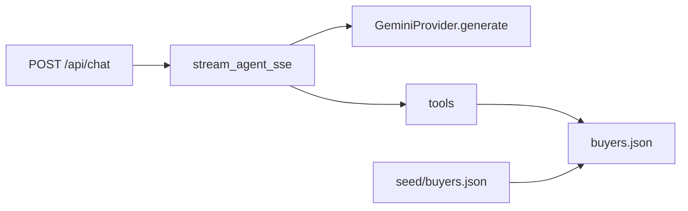

# AI Purchasing Agent — Backend

FastAPI buyer agent with a chat interface. Streams over SSE to the optional Vite frontend.

## Setup

```bash
cd backend
python -m venv .venv
source .venv/Scripts/activate   # Windows Git Bash
pip install -r requirements.txt
cp .env.example .env
# Set GEMINI_API_KEY in .env
```

On first run, if [`app/data/buyers.json`](app/data/buyers.json) is missing it is copied from [`app/data/seed/buyers.json`](app/data/seed/buyers.json).

## Run

```bash
uvicorn app.main:app --host 127.0.0.1 --port 8000 --reload
```

Frontend (optional demo UI): `cd frontend && npm run dev` — proxies `/api` to `:8000`.

## What to read first

1. [`app/agent/prompts.py`](app/agent/prompts.py) — agent rules (scenario text comes from chat)  
2. [`app/agent/runner.py`](app/agent/runner.py) — tool loop, then one final reply over SSE  
3. [`app/tools/registry.py`](app/tools/registry.py) — tool definitions and dispatch  
4. [`app/tools/store.py`](app/tools/store.py) — load/persist live [`app/data/buyers.json`](app/data/buyers.json); seed in [`app/data/seed/buyers.json`](app/data/seed/buyers.json)  
5. [`app/tools/read.py`](app/tools/read.py) / [`app/tools/actions.py`](app/tools/actions.py) — read tools and PO actions  

## Data model

- **Seed:** `app/data/seed/buyers.json` (git tracked, initial ERP snapshot).  
- **Live:** `app/data/buyers.json` (gitignored; PO creates/edits persist here). Reset manually by copying from `app/data/seed/buyers.json`.
- **No session overlay** — one shared world for the app process.
- **Recommendations** come from the **user chat message** only, not from the JSON store.

Default buyer for tools: `BUYER-01`.

## Environment

| Variable | Purpose |
|----------|---------|
| `GEMINI_API_KEY` | Required |
| `GEMINI_MODEL` | Default `gemini-2.0-flash` |
| `MAX_TOOL_ITERATIONS` | Cap on tool rounds before error reply (default `10`) |

## Tests

```bash
pytest
```

Tests use a temp `buyers.json` copied from seed (see [`tests/conftest.py`](tests/conftest.py)).

## Architecture



Past chats: **New chat** → `POST /api/conversations` (transcript only). List/get: `GET /api/conversations`, `GET /api/conversations/{id}`.

## API docs

- Bruno: [`api-collection/`](api-collection/) (`baseUrl` → `:8000`)
- OpenAPI: [`openapi.yaml`](openapi.yaml)
