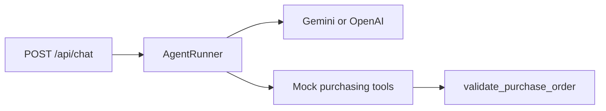

# AI Purchasing Agent — Backend

Python FastAPI service for the buyer agent (Scenario 1). Streams chat over SSE to the Vite frontend.

## Setup

```bash
cd backend
python -m venv .venv
source .venv/Scripts/activate   # Windows Git Bash
pip install -r requirements.txt
cp .env.example .env
# Set GEMINI_API_KEY or switch LLM_PROVIDER=openai and OPENAI_API_KEY
```

## Run

```bash
uvicorn app.main:app --host 127.0.0.1 --port 8000 --reload
```

Frontend: `cd frontend && npm run dev` (proxy `/api` → `:8000`, disable `VITE_MOCK_CHAT`).

## LLM providers

| `LLM_PROVIDER` | Required env |
|----------------|--------------|
| `gemini` (default) | `GEMINI_API_KEY`, optional `GEMINI_MODEL=gemini-2.0-flash` |
| `openai` | `OPENAI_API_KEY`, optional `OPENAI_BASE_URL`, `OPENAI_MODEL` |

Optional: Gemini via OpenAI-compatible API — `LLM_PROVIDER=openai`, `OPENAI_BASE_URL=https://generativelanguage.googleapis.com/v1beta/openai/`, key = Gemini API key.

## Tests

```bash
pytest
```

Tool/validation tests run without live LLM keys. Chat route test mocks the agent stream.

## Architecture



Session state: header `X-Session-Id` (default `default`); mock data from `app/data/scenario1.json`.

## API docs

- Bruno collection: [`api-collection/`](api-collection/) (`opencollection.yml`, `baseUrl` → `:8000`)
- OpenAPI: [`openapi.yaml`](openapi.yaml)
