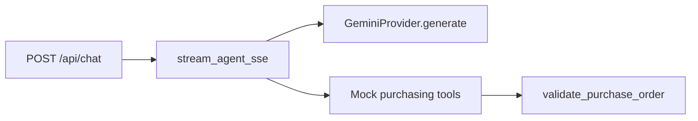

# AI Purchasing Agent — Backend

FastAPI service for Scenario 1 (buyer agent). Chat streams over SSE to the optional Vite frontend.

## Setup

```bash
cd backend
python -m venv .venv
source .venv/Scripts/activate   # Windows Git Bash
pip install -r requirements.txt
cp .env.example .env
# Set GEMINI_API_KEY in .env
```

## Run

```bash
uvicorn app.main:app --host 127.0.0.1 --port 8000 --reload
```

Frontend (optional demo UI): `cd frontend && npm run dev` — proxies `/api` to `:8000`.

## What to read first

1. [`app/agent/prompts.py`](app/agent/prompts.py) — agent rules and scenario context  
2. [`app/agent/runner.py`](app/agent/runner.py) — tool loop, then one final reply over SSE  
3. [`app/tools/registry.py`](app/tools/registry.py) — tool definitions and dispatch  
4. [`app/tools/read.py`](app/tools/read.py) / [`app/tools/actions.py`](app/tools/actions.py) — mock ERP behavior  
5. [`app/data/scenario1.json`](app/data/scenario1.json) — seeded buyer data  

LLM calls go through [`app/agent/llm/gemini_client.py`](app/agent/llm/gemini_client.py) (`generate` only).

## Environment

| Variable | Purpose |
|----------|---------|
| `GEMINI_API_KEY` | Required |
| `GEMINI_MODEL` | Default `gemini-2.0-flash` |
| `MAX_TOOL_ITERATIONS` | Cap on tool rounds before error reply (default `10`) |

## Tests

```bash
pytest
```

Tool/validation tests need no live API key. The chat route test mocks the agent stream.

## Architecture



Session state: header `X-Session-Id` (default `default`); mock data from `app/data/scenario1.json`.

## API docs

- Bruno: [`api-collection/`](api-collection/) (`baseUrl` → `:8000`)
- OpenAPI: [`openapi.yaml`](openapi.yaml)
