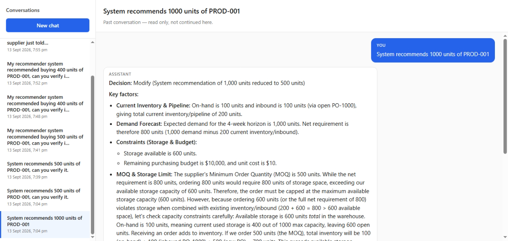

# Frontend

React chat UI for the purchasing agent. Requires the [backend](../backend/README.md) on port 8000.

```bash
npm install
npm run dev
```

Open http://127.0.0.1:5173

## Screenshots

Demo captures live in [`demo/`](demo/). Full gallery and scenario notes: [root README — Demo](../README.md#demo-ui-screenshots).

| Preview |
|--------|
|  |

Additional images: `demo/2.png` … `demo/5.png` (MOQ verification, supplier short-ship, confirmation flow, onboarding).
